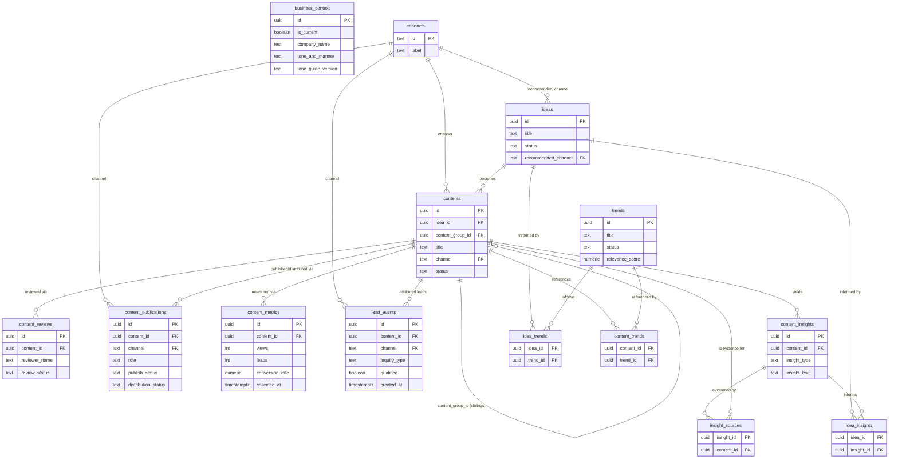

# Codepresso Marketing Automation — Database Schema

## 1. Overview

This document defines the PostgreSQL schema for Ganache's Codepresso Marketing Automation prototype (Zero100 Korean AI Builderthon).

The database is not a generic CMS. It is the **shared memory** between:

- a **web UI** (human-facing dashboard and input surface),
- **Agent 1 — Strategy** (stages ①–② Idea + Planning),
- **Agent 2 — Content & Distribution** (stages ③–⑥ Writing, Editing, Publishing, SNS Distribution),
- **Agent 3 — Measurement & Learning** (stages ⑦–⑧ Performance Collection + Insight), and
- a **Review / Risk Check gate** — not owned by one agent, but a cross-cutting human-approval checkpoint that sits between stages (see Section 8).

> This 3-agent framing was revised from an earlier draft (Agent 1 = Idea/Planning, Agent 2 = Content Generation, Agent 3 = Review/Optimization) after mentor feedback pointed out it left stages ⑤–⑧ ambiguous. The new split matches how the team actually divides work: strategy → content & distribution → measurement.

Every table exists to support one loop:

```
BUSINESS CONTEXT + CURRENT TRENDS + PAST CONTENT + PAST PERFORMANCE + PAST INSIGHTS
        ↓
      IDEA
        ↓
     CONTENT
        ↓
  HUMAN REVIEW / APPROVAL
        ↓
     PUBLISH
        ↓
     METRICS
        ↓
    INSIGHT
        ↓
   (back to IDEA)
```

No existing backend, ORM, or migration tool was found in this repository at the time of writing (only `CLAUDE.md` and the Builderthon problem PDF exist). This schema is therefore designed **PostgreSQL-first**, with plain SQL DDL that can be dropped into any standard migration tool (Prisma, Knex, node-pg-migrate, Alembic, Flyway, etc.) later without conceptual changes.

`docs/tone-and-manner.md` now exists (Ayoung's canonical guide). `business_context.tone_and_manner` deliberately does **not** duplicate it — see Section 6 and Section 13 for why.

## 2. Architecture & Data Flow

```
Web UI
  ↓ writes business_context, reads everything
PostgreSQL  ←──────────────────────────────────────────────────┐
  ↓ (business_context, trends, contents, content_latest_metrics,│
  │  content_insights)                                          │
Agent 1 — Strategy (Idea + Planning, ①–②)                       │
  ↓ writes ideas                                                │
PostgreSQL ───────────────────────────────────────────────────► │
  ↓ (ideas, business_context, trends, contents,                 │
  │  content_insights)                                          │
Agent 2 — Content & Distribution (Writing/Editing/Publishing/SNS,│
           ③–⑥)                                                 │
  ↓ writes contents, content_publications                       │
PostgreSQL ───────────────────────────────────────────────────► │
  ↓ (contents pending review, business_context, trends)         │
Review / Risk Check — cross-cutting gate between stages          │
  ↓ writes content_reviews (and updates contents.status)        │
PostgreSQL ───────────────────────────────────────────────────► │
  ↓ (published contents, content_publications)                  │
Agent 3 — Measurement & Learning (Performance Collection +       │
           Insight, ⑦–⑧)                                        │
  ↓ writes content_metrics, lead_events, content_insights        │
  └─────────────────────────────────────────────────────────────┘
        (insights feed Agent 1's next read, closing the loop)
```

PostgreSQL sits in the middle of every arrow. No agent keeps its own private copy of business context, history, or performance — see Section 3 for why this matters.

## 3. Database Design Principles

1. **PostgreSQL is the single source of truth.** Agents are stateless between runs; they read and write through the database, not through files, memory, or prompt history. This prevents Agent 1, Agent 2, and Agent 3 from silently drifting into inconsistent views of "what Codepresso is" or "what happened before."
2. **Leads are events, not just a number.** `lead_events` records each individual inquiry (which content, which channel, which type, qualified or not) — the real requirement from the challenge is tracing *which content generated which inquiry*, not just a weekly total. `content_metrics.leads` still exists as the aggregate figure used for quick reporting, and should reconcile with `count(lead_events)` where event-level detail is available.
3. **The feedback loop must be traceable with real foreign keys**, not comma-separated ID lists: `idea_trends`, `content_trends`, `insight_sources`, and `idea_insights` are proper many-to-many junction tables.
4. **Human approval is a first-class workflow step**, represented by `content_reviews`, not just a status flag with no audit trail.
5. **MVP over enterprise design.** No user/auth system, no polymorphic "universal provenance" table, no per-platform metrics explosion, no premature versioning machinery. Where a tradeoff was made for simplicity, it is called out in Section 13.
6. **JSONB is used only as an escape hatch**, for genuinely unpredictable structured data (channel-specific extra metrics, free-form extra business context) — never as a replacement for relationships that the app will actually query or join on.

## 4. Entity Overview

| Table | Purpose |
|---|---|
| `business_context` | Codepresso's reusable brand/business knowledge, one "current" version at a time |
| `channels` | Small reference list of distribution channels (blog, LinkedIn, YouTube, etc.) |
| `trends` | External news/issues/trends collected as planning input |
| `ideas` | Content ideas proposed by Agent 1 |
| `idea_trends` | Many-to-many: which trends informed which idea |
| `contents` | The central content entity (draft → review → approved → published); `content_group_id` links channel variants of the same idea |
| `content_trends` | Many-to-many: which trends a piece of content directly references |
| `content_reviews` | Human review/approval events for a content item (cross-cutting quality gate) |
| `content_publications` | One row per publish/distribution action for a content item (merges stages ⑤ Upload + ⑥ SNS Distribution) |
| `content_metrics` | Periodic performance snapshots per content item (views, clicks, aggregate leads) |
| `lead_events` | One row per individual inquiry/lead, attributed to a content item and channel |
| `content_insights` | Structured, reusable insights derived from performance |
| `insight_sources` | Many-to-many: which content items are evidence for an insight |
| `idea_insights` | Many-to-many: which insights informed a given idea |

## 5. ERD



`business_context` is intentionally **not** drawn with a foreign key into `ideas`/`contents`. It is a small, global, singleton-like table (see Section 6) that every agent reads directly (`WHERE is_current = true`) rather than joins against per-row — linking it per-idea would add a join with no real query benefit.

## 6. Table Definitions

### `business_context`
Codepresso's reusable brand/business knowledge. Evolves over time via simple "current version" versioning rather than full temporal history — an MVP tradeoff (Section 13). Every agent reads the one row where `is_current = true`.

`tone_and_manner` holds a **short operational summary** (a few sentences an agent can drop straight into a prompt), not the full guide — the canonical, detailed brand voice rules live in `docs/tone-and-manner.md` (maintained by Ayoung). `tone_guide_version` records which version of that document the summary reflects (e.g. `"tone-and-manner.md v1 (2026-08-24)"`), so the two can be reconciled instead of silently drifting apart.

### `channels`
A tiny seeded reference table (`blog_kr`, `blog_en`, `linkedin`, `youtube`, `newsletter`, `pr`, `webinar`, `other`). Exists so `contents.channel` and `ideas.recommended_channel` are foreign-key-checked instead of freeform strings that can typo-drift across 30+ pieces of content a month.

### `trends`
External issues/news/trends collected as raw planning input for Agent 1. Not a news archive — only fields needed to judge relevance and trace it into an idea.

### `ideas`
Content ideas, each optionally traceable back to the trends and insights that produced it, and forward to the content it became.

### `contents`
The central pipeline entity. Tracks lifecycle status, which idea it came from, and which channel it targets. Publishing/distribution metadata now lives in `content_publications` (see below), not on this table.

`content_group_id` (nullable, self-referencing) links channel variants written from the same idea — e.g. a blog article and its LinkedIn/newsletter adaptations. The first content row in a family leaves it `NULL`; sibling rows point at that first row's `id`. This is a grouping hint for the UI/agents, not a separate table — kept deliberately lightweight for the MVP.

### `content_reviews`
One row per review event (append-only audit trail — a reviewer resubmitting review creates a new row rather than overwriting history). Represents the human-in-the-loop checkpoint the challenge requires. This is a **cross-cutting gate**, not something only one agent triggers — it can sit between idea→content, draft→approved, or publish→distribute.

### `content_publications`
One row per publish/distribution action for a content item — merges what used to be split across Stage ⑤ (Upload) and Stage ⑥ (SNS Distribution). `role` distinguishes a content's primary publish (`'primary'`) from a secondary cross-post/share (`'secondary'`), so e.g. a blog post published to `blog_kr` and then shared as a LinkedIn post both show up here, each with its own `scheduled_at`, `publish_status`, `platform_url`, and `distribution_status`. A content item can have multiple rows here (one per destination); `contents.status = 'published'` is the coarse pipeline signal, this table is the itemized ledger behind it.

### `content_metrics`
Periodic performance snapshots (cumulative totals as of `collected_at`, matching the team's current "collect numbers every Friday" habit). Time-series, not a single row per content — multiple snapshots over a content's life are expected and useful. `leads` here is an aggregate figure for quick reporting; see `lead_events` for per-inquiry detail.

### `lead_events`
One row per individual inquiry, so "3 leads" is traceable evidence (which content, which channel, what type of inquiry, whether it was actually a qualified B2B lead) instead of an opaque number. `content_id`/`channel` are nullable because not every inbound inquiry can always be attributed to a specific piece of content, but should be filled in whenever attribution is known.

### `content_insights`
Structured, reusable statements like *"content addressing enterprise decision-makers converts better than developer-focused content."* Deliberately generalized above the level of a single `content_id` — see `insight_sources` below.

### `insight_sources` / `idea_insights` / `idea_trends` / `content_trends`
Pure many-to-many junction tables. These are what make "performance → insight → next idea" and "trend → idea → content" actually queryable instead of anecdotal.

## 7. Relationships

- `channels (1) ── (N) contents`, `channels (1) ── (N) ideas` — restrict/nullable respectively (Section 9).
- `ideas (1) ── (N) contents` — one idea can spawn multiple content pieces (e.g. a blog post *and* a LinkedIn post from the same idea).
- `ideas (N) ── (N) trends` via `idea_trends` — an idea can be informed by multiple trends; a trend can seed multiple ideas.
- `contents (N) ── (N) trends` via `content_trends` — for content that cites a trend directly, independent of which idea it came from.
- `contents (1) ── (N) contents` via `content_group_id` — self-referencing; groups channel variants (blog/LinkedIn/newsletter) written from the same idea.
- `contents (1) ── (N) content_reviews` — full review history per content.
- `contents (1) ── (N) content_publications` — one row per channel the content is published/distributed to (merges old Stage ⑤+⑥).
- `contents (1) ── (N) content_metrics` — performance over time per content.
- `contents (1) ── (N) lead_events` — individual inquiries attributed to this content.
- `contents (1) ── (N) content_insights`, with `content_insights (N) ── (N) contents` via `insight_sources` for insights generalized across multiple content items.
- `ideas (N) ── (N) content_insights` via `idea_insights` — records exactly which insights led to which new idea, closing the loop with a real, queryable edge.

## 8. Agent Read / Write Contract

This was revised from an earlier draft where "Agent 3 = Review/Optimization" left stages ⑤–⑧ unclear about who does what. Review/approval is reframed as a **cross-cutting gate** rather than one agent's job, matching how the team actually splits work.

**Agent 1 — Strategy (stages ① Idea + ② Planning)**
- READ: `business_context` (current), `trends`, `contents` (past), `content_latest_metrics`, `content_insights`
- WRITE: `ideas`, `idea_trends`, `idea_insights`

**Agent 2 — Content & Distribution (stages ③ Writing, ④ Editing, ⑤ Publishing, ⑥ SNS Distribution)**
- READ: `business_context` (current), `ideas` (selected), `trends`, `contents` (past, for style/precedent), `content_insights`
- WRITE: `contents` (including `content_group_id` when producing a channel variant), `content_trends`, `content_publications`

**Agent 3 — Measurement & Learning (stages ⑦ Performance Collection + ⑧ Insight)**
- READ: `contents`, `content_publications` (to know what's actually live and where), `content_metrics`, historical `content_insights`
- WRITE: `content_metrics`, `lead_events`, `content_insights`, `insight_sources`

**Review / Risk Check — cross-cutting quality gate (human-in-the-loop, not tied to one agent)**
Can sit between idea → content (is this worth writing), draft → approved (is this ready to publish), or publish → distribute (is secondary distribution appropriate). Triggered by whichever agent reaches that checkpoint, but the decision itself is a human approval.
- READ: `contents` (draft), `business_context` (current, for tone/prohibited terms/sensitive-info rules), `trends`, `content_insights`
- WRITE: `content_reviews`, and updates `contents.status`

## 9. PostgreSQL DDL

```sql
-- =========================================================
-- Extensions
-- =========================================================
-- gen_random_uuid() is built into PostgreSQL 13+, but pgcrypto
-- is enabled explicitly so this script also works unmodified
-- on PostgreSQL 12 and earlier.
CREATE EXTENSION IF NOT EXISTS "pgcrypto";

-- =========================================================
-- Reusable trigger: keep updated_at current
-- =========================================================
CREATE OR REPLACE FUNCTION set_updated_at()
RETURNS TRIGGER AS $$
BEGIN
  NEW.updated_at = now();
  RETURN NEW;
END;
$$ LANGUAGE plpgsql;

-- =========================================================
-- channels
-- =========================================================
CREATE TABLE channels (
    id          TEXT PRIMARY KEY,        -- e.g. 'blog_kr', 'linkedin'
    label       TEXT NOT NULL,           -- e.g. 'Korean Blog'
    is_active   BOOLEAN NOT NULL DEFAULT true
);

-- =========================================================
-- business_context
-- =========================================================
CREATE TABLE business_context (
    id                      UUID PRIMARY KEY DEFAULT gen_random_uuid(),
    is_current              BOOLEAN NOT NULL DEFAULT true,
    company_name            TEXT NOT NULL,
    company_description     TEXT,
    target_audience         TEXT,
    products_services       TEXT,
    value_propositions      TEXT,
    brand_positioning       TEXT,
    tone_and_manner         TEXT,        -- short operational summary; full guide lives in docs/tone-and-manner.md
    tone_guide_version      TEXT,        -- e.g. 'tone-and-manner.md v1 (2026-08-24)' — which version of that doc this summary reflects
    preferred_terminology   JSONB NOT NULL DEFAULT '{}',   -- e.g. {"AI 역량진단": "always use this term, not 'AI 테스트'"}
    prohibited_terminology  JSONB NOT NULL DEFAULT '{}',
    sensitive_topics        TEXT,        -- guidance on what needs management approval (pricing, named customers, contract terms)
    extra_context           JSONB NOT NULL DEFAULT '{}',   -- free-form escape hatch for anything not modeled above
    created_at              TIMESTAMPTZ NOT NULL DEFAULT now(),
    superseded_at           TIMESTAMPTZ
);

-- Only one row may be the "current" business context at a time.
CREATE UNIQUE INDEX one_current_business_context
    ON business_context (is_current)
    WHERE is_current;

-- =========================================================
-- trends
-- =========================================================
CREATE TABLE trends (
    id                    UUID PRIMARY KEY DEFAULT gen_random_uuid(),
    title                 TEXT NOT NULL,
    summary               TEXT,
    source                TEXT,
    url                   TEXT,
    published_at          TIMESTAMPTZ,
    collected_at          TIMESTAMPTZ NOT NULL DEFAULT now(),
    relevance_score       NUMERIC(3,2) CHECK (relevance_score BETWEEN 0 AND 1),
    relevance_explanation TEXT,
    status                TEXT NOT NULL DEFAULT 'new'
                          CHECK (status IN ('new', 'reviewed', 'used', 'archived')),
    tags                  TEXT[] NOT NULL DEFAULT '{}',
    created_at            TIMESTAMPTZ NOT NULL DEFAULT now(),
    updated_at            TIMESTAMPTZ NOT NULL DEFAULT now()
);

CREATE TRIGGER trends_set_updated_at
    BEFORE UPDATE ON trends
    FOR EACH ROW EXECUTE FUNCTION set_updated_at();

-- =========================================================
-- ideas
-- =========================================================
CREATE TABLE ideas (
    id                  UUID PRIMARY KEY DEFAULT gen_random_uuid(),
    title               TEXT NOT NULL,
    description         TEXT,
    rationale           TEXT,
    target_audience     TEXT,
    recommended_channel TEXT REFERENCES channels(id) ON DELETE SET NULL,
    marketing_goal      TEXT,
    status              TEXT NOT NULL DEFAULT 'proposed'
                        CHECK (status IN ('proposed', 'selected', 'in_progress', 'converted', 'rejected')),
    created_at          TIMESTAMPTZ NOT NULL DEFAULT now(),
    updated_at          TIMESTAMPTZ NOT NULL DEFAULT now()
);

CREATE TRIGGER ideas_set_updated_at
    BEFORE UPDATE ON ideas
    FOR EACH ROW EXECUTE FUNCTION set_updated_at();

-- =========================================================
-- idea_trends (M:N)
-- =========================================================
CREATE TABLE idea_trends (
    idea_id  UUID NOT NULL REFERENCES ideas(id)  ON DELETE CASCADE,
    trend_id UUID NOT NULL REFERENCES trends(id) ON DELETE CASCADE,
    PRIMARY KEY (idea_id, trend_id)
);

-- =========================================================
-- contents
-- =========================================================
CREATE TABLE contents (
    id                     UUID PRIMARY KEY DEFAULT gen_random_uuid(),
    idea_id                UUID REFERENCES ideas(id) ON DELETE SET NULL,
    content_group_id       UUID REFERENCES contents(id) ON DELETE SET NULL,  -- links sibling channel variants of the same idea; NULL on the first/original row
    title                  TEXT NOT NULL,
    body                   TEXT,                -- Markdown
    thumbnail_text         TEXT,
    channel                TEXT NOT NULL REFERENCES channels(id) ON DELETE RESTRICT,
    status                 TEXT NOT NULL DEFAULT 'draft'
                           CHECK (status IN ('draft', 'review', 'approved', 'published', 'rejected', 'archived')),
    contains_sensitive_info BOOLEAN NOT NULL DEFAULT false,  -- customer names / pricing / contract terms present
    created_at             TIMESTAMPTZ NOT NULL DEFAULT now(),
    updated_at             TIMESTAMPTZ NOT NULL DEFAULT now()
);

CREATE TRIGGER contents_set_updated_at
    BEFORE UPDATE ON contents
    FOR EACH ROW EXECUTE FUNCTION set_updated_at();

-- =========================================================
-- content_trends (M:N)
-- =========================================================
CREATE TABLE content_trends (
    content_id UUID NOT NULL REFERENCES contents(id) ON DELETE CASCADE,
    trend_id   UUID NOT NULL REFERENCES trends(id)   ON DELETE CASCADE,
    PRIMARY KEY (content_id, trend_id)
);

-- =========================================================
-- content_publications (merges Stage 5 Upload + Stage 6 SNS Distribution)
-- =========================================================
CREATE TABLE content_publications (
    id                  UUID PRIMARY KEY DEFAULT gen_random_uuid(),
    content_id          UUID NOT NULL REFERENCES contents(id) ON DELETE CASCADE,
    channel             TEXT NOT NULL REFERENCES channels(id) ON DELETE RESTRICT,
    role                TEXT NOT NULL DEFAULT 'primary'
                        CHECK (role IN ('primary', 'secondary')),  -- primary = Stage 5 upload, secondary = Stage 6 cross-post
    scheduled_at        TIMESTAMPTZ,
    publish_status      TEXT NOT NULL DEFAULT 'scheduled'
                        CHECK (publish_status IN ('scheduled', 'published', 'failed', 'skipped')),
    published_at        TIMESTAMPTZ,
    platform_post_id    TEXT,
    platform_url        TEXT,
    distribution_status TEXT NOT NULL DEFAULT 'pending'
                        CHECK (distribution_status IN ('pending', 'distributed', 'skipped')),
    distributed_at      TIMESTAMPTZ,
    created_at          TIMESTAMPTZ NOT NULL DEFAULT now(),
    updated_at          TIMESTAMPTZ NOT NULL DEFAULT now()
);

CREATE TRIGGER content_publications_set_updated_at
    BEFORE UPDATE ON content_publications
    FOR EACH ROW EXECUTE FUNCTION set_updated_at();

-- =========================================================
-- content_reviews (append-only)
-- =========================================================
CREATE TABLE content_reviews (
    id                  UUID PRIMARY KEY DEFAULT gen_random_uuid(),
    content_id          UUID NOT NULL REFERENCES contents(id) ON DELETE CASCADE,
    reviewer_name       TEXT NOT NULL,     -- no auth system yet; plain identifier is enough for the prototype
    review_status       TEXT NOT NULL DEFAULT 'pending'
                        CHECK (review_status IN ('pending', 'approved', 'changes_requested', 'rejected')),
    quality_score       SMALLINT CHECK (quality_score BETWEEN 1 AND 5),
    brand_fit_score     SMALLINT CHECK (brand_fit_score BETWEEN 1 AND 5),
    factual_risk        TEXT NOT NULL DEFAULT 'none'
                        CHECK (factual_risk IN ('none', 'low', 'medium', 'high')),
    sensitive_info_risk BOOLEAN NOT NULL DEFAULT false,
    feedback            TEXT,
    reviewed_at         TIMESTAMPTZ,
    created_at          TIMESTAMPTZ NOT NULL DEFAULT now()
);

-- =========================================================
-- content_metrics (append-only time series)
-- =========================================================
CREATE TABLE content_metrics (
    id              UUID PRIMARY KEY DEFAULT gen_random_uuid(),
    content_id      UUID NOT NULL REFERENCES contents(id) ON DELETE CASCADE,
    views           INT NOT NULL DEFAULT 0 CHECK (views >= 0),
    clicks          INT CHECK (clicks >= 0),
    leads           INT NOT NULL DEFAULT 0 CHECK (leads >= 0),
    conversion_rate NUMERIC(6,4) GENERATED ALWAYS AS (
                        CASE WHEN views > 0 THEN ROUND(leads::numeric / views, 4) ELSE NULL END
                    ) STORED,
    extra_metrics   JSONB NOT NULL DEFAULT '{}',  -- channel-specific extras: impressions, opens, attendees, watch_time...
    collected_at    TIMESTAMPTZ NOT NULL DEFAULT now()
);

-- =========================================================
-- lead_events (append-only) — individual inquiry-level attribution
-- =========================================================
CREATE TABLE lead_events (
    id                 UUID PRIMARY KEY DEFAULT gen_random_uuid(),
    content_id         UUID REFERENCES contents(id) ON DELETE SET NULL,
    channel            TEXT REFERENCES channels(id) ON DELETE SET NULL,
    inquiry_type       TEXT NOT NULL DEFAULT 'other'
                       CHECK (inquiry_type IN ('contact_form', 'demo_request', 'newsletter_signup', 'webinar_registration', 'email', 'other')),
    qualified          BOOLEAN NOT NULL DEFAULT false,  -- is this a genuine B2B sales-worthy inquiry, not just any form submission
    attribution_source TEXT,  -- e.g. UTM string, referrer, or how this event was linked back to the content
    created_at         TIMESTAMPTZ NOT NULL DEFAULT now()
);

-- =========================================================
-- content_insights (append-only)
-- =========================================================
CREATE TABLE content_insights (
    id            UUID PRIMARY KEY DEFAULT gen_random_uuid(),
    content_id    UUID REFERENCES contents(id) ON DELETE SET NULL,  -- primary example content, if any
    insight_type  TEXT NOT NULL DEFAULT 'general'
                  CHECK (insight_type IN ('content-level', 'topic-level', 'channel-level', 'audience-level', 'general')),
    insight_text  TEXT NOT NULL,
    confidence    NUMERIC(3,2) CHECK (confidence BETWEEN 0 AND 1),
    created_at    TIMESTAMPTZ NOT NULL DEFAULT now()
);

-- =========================================================
-- insight_sources (M:N) — which content backs an insight
-- =========================================================
CREATE TABLE insight_sources (
    insight_id UUID NOT NULL REFERENCES content_insights(id) ON DELETE CASCADE,
    content_id UUID NOT NULL REFERENCES contents(id)         ON DELETE CASCADE,
    PRIMARY KEY (insight_id, content_id)
);

-- =========================================================
-- idea_insights (M:N) — which insights informed a new idea
-- =========================================================
CREATE TABLE idea_insights (
    idea_id    UUID NOT NULL REFERENCES ideas(id)             ON DELETE CASCADE,
    insight_id UUID NOT NULL REFERENCES content_insights(id)  ON DELETE CASCADE,
    PRIMARY KEY (idea_id, insight_id)
);
```

## 10. Indexing Strategy

```sql
-- contents: pipeline dashboard + agent lookups
CREATE INDEX idx_contents_status        ON contents (status);
CREATE INDEX idx_contents_channel       ON contents (channel);
CREATE INDEX idx_contents_idea_id       ON contents (idea_id);
CREATE INDEX idx_contents_group_id      ON contents (content_group_id);

-- content_publications: "approved but not yet published" + distribution queue
CREATE INDEX idx_content_publications_content_id ON content_publications (content_id);
CREATE INDEX idx_content_publications_pending
    ON content_publications (content_id)
    WHERE publish_status = 'scheduled' OR distribution_status = 'pending';

-- content_metrics: "latest per content" and "top by leads" queries
CREATE INDEX idx_content_metrics_content_collected
    ON content_metrics (content_id, collected_at DESC);
CREATE INDEX idx_content_metrics_leads ON content_metrics (leads DESC);

-- lead_events: attribution look-ups
CREATE INDEX idx_lead_events_content_id ON lead_events (content_id);
CREATE INDEX idx_lead_events_channel    ON lead_events (channel);
CREATE INDEX idx_lead_events_created_at ON lead_events (created_at DESC);

-- content_reviews: pending queue + per-content history
CREATE INDEX idx_content_reviews_content_id ON content_reviews (content_id);
CREATE INDEX idx_content_reviews_pending
    ON content_reviews (content_id)
    WHERE review_status = 'pending';

-- trends: recency + status + tag search
CREATE INDEX idx_trends_collected_at ON trends (collected_at DESC);
CREATE INDEX idx_trends_status       ON trends (status);
CREATE INDEX idx_trends_tags         ON trends USING GIN (tags);

-- ideas
CREATE INDEX idx_ideas_status ON ideas (status);

-- junction tables: reverse-lookup side
CREATE INDEX idx_idea_trends_trend_id       ON idea_trends (trend_id);
CREATE INDEX idx_content_trends_trend_id    ON content_trends (trend_id);
CREATE INDEX idx_content_insights_content_id ON content_insights (content_id);
CREATE INDEX idx_insight_sources_content_id ON insight_sources (content_id);
CREATE INDEX idx_idea_insights_idea_id      ON idea_insights (idea_id);
```

Two small views make the "latest performance" pattern (needed by queries 1–4, 9, 10, 12, 15) reusable instead of re-written in every agent prompt / API handler:

```sql
-- Most recent metrics snapshot per content item.
CREATE VIEW content_latest_metrics AS
SELECT DISTINCT ON (content_id)
    content_id, views, clicks, leads, conversion_rate, extra_metrics, collected_at
FROM content_metrics
ORDER BY content_id, collected_at DESC;

-- One row per content item, for the dashboard pipeline view.
CREATE VIEW content_pipeline_overview AS
SELECT
    c.id, c.title, c.channel, c.status, c.content_group_id,
    pub.published_at, pub.platform_url,
    lm.views, lm.leads, lm.conversion_rate,
    lr.review_status AS latest_review_status
FROM contents c
LEFT JOIN content_latest_metrics lm ON lm.content_id = c.id
LEFT JOIN LATERAL (
    SELECT review_status
    FROM content_reviews r
    WHERE r.content_id = c.id
    ORDER BY r.created_at DESC
    LIMIT 1
) lr ON true
LEFT JOIN LATERAL (
    SELECT published_at, platform_url
    FROM content_publications p
    WHERE p.content_id = c.id AND p.role = 'primary'
    ORDER BY p.created_at DESC
    LIMIT 1
) pub ON true;
```

## 11. Key Queries / Access Patterns

```sql
-- 1. Recently collected metrics
SELECT * FROM content_metrics ORDER BY collected_at DESC LIMIT 50;

-- 2. Top-performing content by leads
SELECT * FROM content_latest_metrics ORDER BY leads DESC LIMIT 10;

-- 3. Highest lead conversion rate
SELECT * FROM content_latest_metrics
WHERE views >= 100          -- ignore statistically meaningless small samples
ORDER BY conversion_rate DESC LIMIT 10;

-- 4. High views, low leads
SELECT * FROM content_latest_metrics
WHERE views > 1000 AND conversion_rate < 0.01
ORDER BY views DESC;

-- 5. Recent trends relevant to Codepresso
SELECT * FROM trends
WHERE relevance_score >= 0.6
ORDER BY collected_at DESC LIMIT 20;

-- 6. Ideas generated from recent trends
SELECT i.* FROM ideas i
JOIN idea_trends it ON it.idea_id = i.id
JOIN trends t ON t.id = it.trend_id
WHERE t.collected_at > now() - interval '14 days';

-- 7. Content awaiting review
SELECT * FROM contents WHERE status = 'review';

-- 8. Approved but not yet published
SELECT c.* FROM contents c
WHERE c.status = 'approved'
  AND NOT EXISTS (
    SELECT 1 FROM content_publications p
    WHERE p.content_id = c.id AND p.role = 'primary' AND p.publish_status = 'published'
  );

-- 9. Historical performance for one content item
SELECT * FROM content_metrics WHERE content_id = $1 ORDER BY collected_at;

-- 10. Insights from high-performing content
SELECT DISTINCT ci.* FROM content_insights ci
JOIN insight_sources s ON s.insight_id = ci.id
JOIN content_latest_metrics lm ON lm.content_id = s.content_id
WHERE lm.leads >= 5
ORDER BY ci.created_at DESC;

-- 11. Past ideas related to a particular trend
SELECT i.* FROM ideas i
JOIN idea_trends it ON it.idea_id = i.id
WHERE it.trend_id = $1;

-- 12. Context for Agent 1 (idea generation)
SELECT * FROM business_context WHERE is_current;
SELECT * FROM trends WHERE status = 'new' ORDER BY relevance_score DESC LIMIT 10;
SELECT * FROM content_latest_metrics ORDER BY leads DESC LIMIT 10;
SELECT * FROM content_insights ORDER BY created_at DESC LIMIT 20;

-- 13. Context for Agent 2 (content generation), given a selected idea $1
SELECT * FROM business_context WHERE is_current;
SELECT * FROM ideas WHERE id = $1;
SELECT t.* FROM trends t JOIN idea_trends it ON it.trend_id = t.id WHERE it.idea_id = $1;
SELECT * FROM contents WHERE channel = (SELECT recommended_channel FROM ideas WHERE id = $1)
ORDER BY created_at DESC LIMIT 5;

-- 14. Context for Agent 3 (review), given a draft content $1
SELECT * FROM contents WHERE id = $1;
SELECT * FROM business_context WHERE is_current;
SELECT t.* FROM trends t JOIN content_trends ct ON ct.trend_id = t.id WHERE ct.content_id = $1;
SELECT * FROM content_insights ORDER BY created_at DESC LIMIT 20;

-- 15. Dashboard pipeline view
SELECT * FROM content_pipeline_overview ORDER BY status, published_at DESC NULLS LAST;

-- 16. Content awaiting secondary (SNS) distribution
SELECT c.title, p.channel, p.distribution_status FROM content_publications p
JOIN contents c ON c.id = p.content_id
WHERE p.role = 'secondary' AND p.distribution_status = 'pending';

-- 17. Which content/channel is generating qualified leads
SELECT c.title, le.channel, count(*) FILTER (WHERE le.qualified) AS qualified_leads
FROM lead_events le
JOIN contents c ON c.id = le.content_id
GROUP BY c.title, le.channel
ORDER BY qualified_leads DESC;

-- 18. Channel variants that came from the same idea/content family
SELECT * FROM contents
WHERE content_group_id = $1 OR id = $1;
```

## 12. Example Data

```sql
INSERT INTO channels (id, label) VALUES
    ('blog_kr', 'Korean Blog'),
    ('blog_en', 'English Blog'),
    ('linkedin', 'LinkedIn'),
    ('youtube', 'YouTube'),
    ('newsletter', 'Newsletter'),
    ('pr', 'PR / Media'),
    ('webinar', 'Offline Seminar / Webinar'),
    ('other', 'Other');

INSERT INTO business_context (company_name, company_description, target_audience, tone_and_manner, tone_guide_version)
VALUES (
    'Codepresso',
    'B2B provider of AI competency assessment, AI education, and AI transformation (AX) consulting for enterprises and public institutions.',
    'HR/L&D leaders and executives at large and mid-sized companies and public-sector organizations.',
    '실무 중심적 · 전문적이지만 이해하기 쉬운 · 근거 중심적 · 대화하듯 자연스러운 · 현실적이고 절제된 톤 유지. 과장 표현·상투적 AI 문장 금지. 고객사명·가격·계약조건·성과 수치는 검증된 자료가 있을 때만 사용. 공식 명칭은 임의 변경 금지.',
    'tone-and-manner.md v1 (2026-08-24)'
);

INSERT INTO trends (title, summary, source, relevance_score, relevance_explanation, status, tags)
VALUES (
    'Enterprise AI adoption accelerating in Korea',
    'Large Korean enterprises are increasing AI training budgets for 2026 but struggle to operationalize training into measurable outcomes.',
    'industry news roundup',
    0.85,
    'Directly matches Codepresso''s AI education and AX consulting offering.',
    'new',
    ARRAY['enterprise-ai', 'training', 'kr-market']
);

WITH t AS (SELECT id FROM trends LIMIT 1)
INSERT INTO ideas (title, description, rationale, target_audience, recommended_channel, marketing_goal, status)
SELECT
    'Why companies struggle to operationalize AI training',
    'An article explaining the gap between AI training completion and real workplace AI adoption, framed around Codepresso''s AX consulting approach.',
    'Directly ties a hot trend to a Codepresso service gap; enterprise decision-makers are the audience most likely to submit an inquiry.',
    'Corporate HR/L&D and AX decision-makers',
    'linkedin',
    'lead-generation',
    'selected'
FROM t;

INSERT INTO idea_trends (idea_id, trend_id)
SELECT i.id, t.id FROM ideas i, trends t LIMIT 1;

WITH i AS (SELECT id FROM ideas LIMIT 1)
INSERT INTO contents (idea_id, title, body, channel, status)
SELECT
    i.id,
    'Why Your AI Training Budget Isn''t Producing AI-Fluent Teams',
    '# Why Your AI Training Budget Isn''t Producing AI-Fluent Teams\n\n...(markdown body)...',
    'linkedin',
    'published'
FROM i;

INSERT INTO content_reviews (content_id, reviewer_name, review_status, quality_score, brand_fit_score, factual_risk, feedback, reviewed_at)
SELECT id, 'Seojin', 'approved', 4, 5, 'none', 'Good enterprise framing, on-brand.', now() - interval '11 days'
FROM contents LIMIT 1;

-- Primary publish (Stage 5) and a secondary cross-post (Stage 6), both on content_publications.
INSERT INTO content_publications (content_id, channel, role, publish_status, published_at, platform_url, distribution_status, distributed_at)
SELECT id, 'linkedin', 'primary', 'published', now() - interval '10 days', 'https://linkedin.com/example-post', 'distributed', now() - interval '10 days'
FROM contents LIMIT 1;
INSERT INTO content_publications (content_id, channel, role, publish_status, distribution_status)
SELECT id, 'newsletter', 'secondary', 'scheduled', 'pending'
FROM contents LIMIT 1;

INSERT INTO content_metrics (content_id, views, clicks, leads, collected_at)
SELECT id, 1200, 85, 2, now() - interval '9 days' FROM contents LIMIT 1;
INSERT INTO content_metrics (content_id, views, clicks, leads, collected_at)
SELECT id, 4300, 210, 7, now() - interval '2 days' FROM contents LIMIT 1;

-- Individual inquiries behind the "7 leads" aggregate above.
INSERT INTO lead_events (content_id, channel, inquiry_type, qualified, attribution_source)
SELECT id, 'linkedin', 'contact_form', true, 'utm_source=linkedin&utm_campaign=ai-training' FROM contents LIMIT 1;
INSERT INTO lead_events (content_id, channel, inquiry_type, qualified, attribution_source)
SELECT id, 'linkedin', 'demo_request', true, 'utm_source=linkedin&utm_campaign=ai-training' FROM contents LIMIT 1;
INSERT INTO lead_events (content_id, channel, inquiry_type, qualified, attribution_source)
SELECT id, 'newsletter', 'newsletter_signup', false, 'referral link in article' FROM contents LIMIT 1;

WITH c AS (SELECT id FROM contents LIMIT 1)
INSERT INTO content_insights (content_id, insight_type, insight_text, confidence)
SELECT id, 'audience-level',
    'Content addressing enterprise decision-makers (not individual learners) converts noticeably better into leads than developer-focused posts.',
    0.7
FROM c;

INSERT INTO insight_sources (insight_id, content_id)
SELECT ci.id, ct.id FROM content_insights ci, contents ct LIMIT 1;

-- Demonstrates the closed loop: this insight feeds the *next* idea.
WITH ins AS (SELECT id FROM content_insights LIMIT 1)
INSERT INTO ideas (title, description, rationale, target_audience, recommended_channel, marketing_goal, status)
SELECT
    'What HR leaders actually ask before buying AI training',
    'Follow-up piece targeting the same enterprise decision-maker audience that converted well on the previous post.',
    'Directly reuses a confirmed insight about audience targeting rather than guessing.',
    'Corporate HR/L&D decision-makers',
    'blog_kr',
    'lead-generation',
    'proposed'
FROM ins;

INSERT INTO idea_insights (idea_id, insight_id)
SELECT i.id, ins.id FROM ideas i, content_insights ins
WHERE i.title = 'What HR leaders actually ask before buying AI training'
LIMIT 1;
```

## 13. Design Decisions

- **CHECK constraints instead of native PostgreSQL `ENUM` types** for all status columns. Enum values in Postgres can be added but never cleanly removed/renamed without rebuilding the type; during an 8-day hackathon the status vocabulary (e.g. adding a `needs_revision` review status) is likely to change. A `CHECK` constraint is a one-line migration to update.
- **`channels` as a reference table, not an enum or free string.** An enum has the same "hard to change" problem as above; a free string risks silent typos (`LinkedIn` vs `linkedin`) across three people and multiple agents producing 30+ items/month. A tiny reference table gets FK-checked values with a one-row `INSERT` to add a channel.
- **`business_context` versioning is a single `is_current` flag, not full temporal history.** The MVP only ever needs "what is Codepresso's context *right now*" — agents always read the current row. Full bitemporal history was judged as unnecessary complexity for an 8-day build; `superseded_at` is kept so a lightweight history can still be reconstructed later if needed.
- **No user/authentication table.** `content_reviews.reviewer_name` is a plain text field. The challenge asks for human review to exist, not for a login system; adding auth now would be scope creep with zero demo value.
- **`content_metrics` is an append-only time series, not one row per content.** This matches how the team already works (periodic manual collection) and preserves the actual history needed for "historical performance must remain queryable" — overwriting a single row per content would destroy that history.
- **`conversion_rate` is a `GENERATED ALWAYS ... STORED` column**, not computed in application code, so every consumer (SQL query, agent prompt, dashboard) gets the same lead-conversion number without reimplementing the formula, and it stays indexable.
- **`extra_metrics JSONB` instead of per-platform columns.** YouTube, LinkedIn, blog, and newsletter each expose different secondary metrics (watch time, impressions, opens...). Rather than 15+ mostly-null columns, only the two metrics that are universal and business-critical (`views`, `leads`, plus `clicks` where applicable) are real columns; everything else goes in `extra_metrics` and is not expected to be indexed or joined on.
- **No generic/polymorphic "provenance" table.** Traceability is instead expressed through explicit typed junction tables (`idea_trends`, `content_trends`, `insight_sources`, `idea_insights`). This is more verbose than one universal `source_of(entity_type, entity_id, source_type, source_id)` table, but every join stays a normal foreign key — a polymorphic FK cannot be enforced by PostgreSQL and would silently rot.
- **`content_insights.content_id` is nullable and paired with `insight_sources`.** An insight is meant to generalize ("audience-level" or "topic-level" patterns), so it should survive even if one supporting content row is later archived or deleted; `content_id` is kept only as a convenience pointer to the primary example.
- **`content_reviews` and `content_insights` are append-only** (no `updated_at`, no in-place edits). This preserves a full audit trail of review history and how understanding evolved over time, which matters more here than update convenience.
- **UUID primary keys via `gen_random_uuid()` / `pgcrypto`.** UUIDs let the web UI, the three agents, and the collection/insight processes all generate valid, globally-unique IDs independently without round-tripping through the database first (useful once content generation happens in an agent process before the row is even inserted). `pgcrypto` is enabled explicitly so the script also runs unmodified on PostgreSQL versions before 13, where `gen_random_uuid()` is not yet built in.
- **`lead_events` added after mentor review, alongside `content_metrics.leads`.** The challenge's real requirement is tracing *which content produced which inquiry*, not just a weekly total — a bare integer can't answer "was this a qualified B2B lead" or "which channel". `content_metrics.leads` stays as the fast aggregate for dashboards/reporting; `lead_events` is the itemized ledger it should reconcile with. Both are kept rather than only the event table, because historical data collected before this table existed may only have the aggregate.
- **`content_publications` replaces `contents.published_at`/`published_url`.** Stage ⑤ (Upload) and ⑥ (SNS Distribution) were previously compressed into two columns on `contents`, which can't represent "published on the primary channel, then cross-posted to two more" or track a schedule/distribution status separately from the content's own review status. Moving this into its own table also avoids the exact "same fact tracked in two places" risk flagged in review — `contents` no longer carries any publish timestamp of its own.
- **`content_group_id` as a single nullable self-referencing column, not a separate `content_groups` table.** One idea can spawn a blog post, a LinkedIn post, and a newsletter blurb — each needs its own `contents` row because the written body genuinely differs per channel, but the UI/agents still need to know they're siblings. A join table would be more "correct" relationally, but for an MVP a self-referencing pointer (siblings share the first row's `id`) is enough to group them without adding another table to reason about.
- **Agent 1/2/3 reframed as Strategy / Content & Distribution / Measurement & Learning**, with Review/Risk Check pulled out as a cross-cutting gate (Section 8). The original split (Idea/Planning → Content Generation → Review/Optimization) left stages ⑤–⑧ without a clear owner in the architecture. This reframing changes documentation and read/write responsibility only — no new tables were needed, since the underlying data (`contents`, `content_publications`, `content_metrics`, `lead_events`, `content_insights`) already supported it.
- **`business_context.tone_and_manner` holds a summary, not the full guide.** Ayoung owns `docs/tone-and-manner.md` as the canonical, detailed brand-voice document. Duplicating all ~9 sections into a database column would create two sources of truth that can silently diverge. Instead the column holds a short prompt-ready summary plus `tone_guide_version`, so agents get something they can use directly without a filesystem read, while the detailed rules stay maintained in one place.

## 14. MVP Scope vs Future Extensions

**In scope for the MVP (this schema):**
- Business context, trends, ideas, content, review/approval, metrics, insights, and the junction tables connecting them.
- Per-inquiry lead attribution (`lead_events`) alongside aggregate metrics (`content_metrics.leads`).
- Itemized publish/distribution tracking (`content_publications`) merging Stages ⑤+⑥.
- Lightweight cross-channel content grouping (`content_group_id`).
- Simple single-version "current" business context, with a short tone-and-manner summary pointing at the canonical `docs/tone-and-manner.md`.
- Reference-table channels.
- Time-series metrics with a generated conversion-rate column.

**Explicitly deferred to future iterations (do not build now):**
- User accounts / authentication / role-based permissions.
- Deep per-platform integrations (real YouTube Analytics API, LinkedIn API, ESP webhook ingestion, real lead-capture-form webhooks) — the MVP assumes `content_metrics` and `lead_events` are populated via manual entry or a simple import script.
- Automated publishing (real posting to channels) — Section 5 of `CLAUDE.md` requires any mocked publish action to be clearly labeled as mocked, never presented as real.
- Full campaign-level grouping / A/B testing structures (`content_group_id` is a lightweight sibling pointer, not a campaign management system).
- Advanced multi-touch attribution (`lead_events` attributes each inquiry to one content item; multi-content or multi-channel attribution is out of scope).
- Vector search / embeddings for semantic content or trend search.
- Automated news/trend ingestion pipelines (the MVP assumes `trends` rows can be inserted manually or by a simple script).
- Detailed audit logging beyond the append-only review/insight history already built in.
- Full temporal versioning of `business_context` (only a single "current" flag is implemented now).
